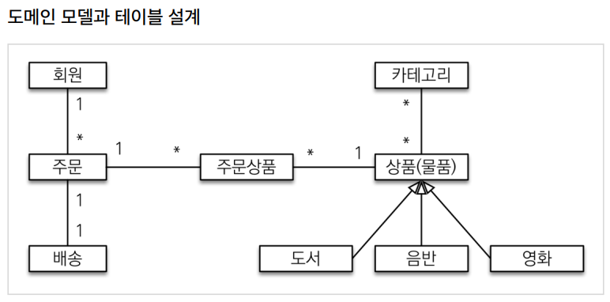
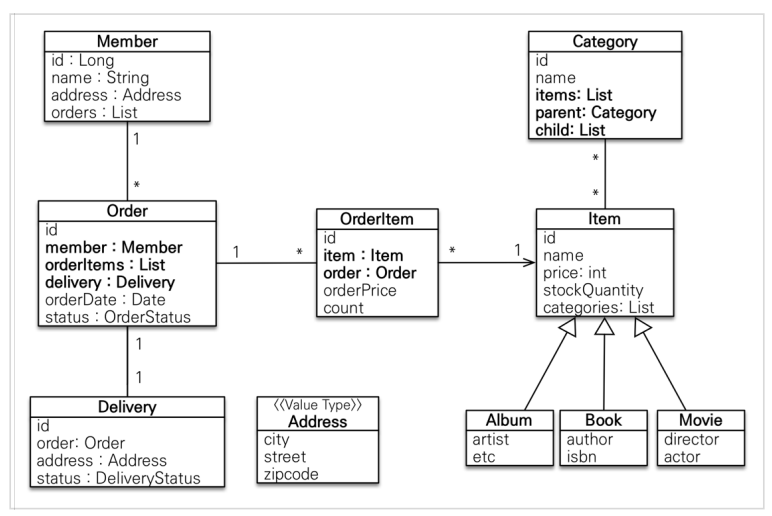
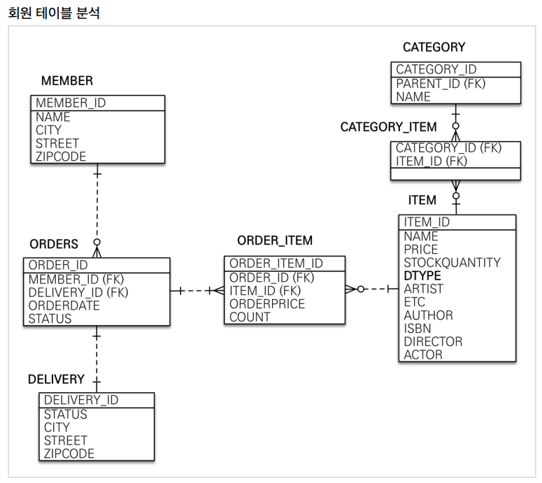

# springboot-and-jpa1
인프런 실전! 스프링 부트와 JPA 활용1 - 웹 애플리케이션 개발 정리

# 섹션0. 강좌 소개
## 강좌 소개
스프링부트 + JPA
#### 강의 목표 : 실무에서 웹 애플리케이션을 제대로 개발
- 프로젝트 환경설정
- 요구사항 분석
- 도메인과 테이블 설계
- 아키텍처 구성
- 핵심 비즈니스 로직 개발(회원, 상품, 주문)
- 테스트
- 웹 계층 개발

# 섹션1. 프로젝트 환경설정
## 프로젝트 생성
Gradle을 통해 필요한 의존관계들을 가져오게 된다.

## 라이브러리 살펴보기
#### 스프링 부트 라이브러리 살펴보기
- spring-boot-starter-web
  - spring-boot-starter-tomcat: 톰캣(웹서버)
  - spring-webmvc: 스프링 웹 MVC
- spring-boot-starter-thymeleaf: 타임리프 템플릿 엔진(View)
- spring-boot-starter-data-jpa
  - spring-boot-starter-aop
  - spring-boot-starter-jdbc
    - HikariCP 커텍션 풀 (부트 2.0 기본)
  - hibernate + JPA: 하이버네이트 + JPA
  - spring-boot-data-jpa: 스프링 데이터 JPA
- spring-boot-starter(공통): 스프링부트 + 스프링 코어 + 로깅
  - spring-boot
    - spring-core
  - spring-boot-starter-logging
    - logback, slf4j
#### 테스트 라이브러리
- spring-boot-starter-test
  - junit: 테스트 프레임워크
  - mockito: 목 라이브러리
  - assertj: 테스트 코드를 좀 더 편하게 작성하게 도와주는 라이브러리
  - spring-test: 스프링 통합 테스트 진행

- 핵심 라이브러리
  - 스프링 MVC
  - 스프링 ORM
  - JPA, 하이버네이트
  - 스프링 데이터 JPA
- 기타 라이브러리 
  - H2 데이터베이스 클라이언트
  - 커넥션 풀: 부트 기본은 HikariCP
  - WEB(thymeleaf)
  - 로깅 SLF$J & LogBack
  - 테스트

참고: 스프링 데이터 JPA는 스프링과 JPA를 먼저 이해하고 사용해야 하는 응용기술이다.

## View 환경설정
### Thymeleaf 템플릿 엔진
- thymeleaf 공식 사이트: https://www.thymeleaf.org/
- 스프링 공식 튜토리얼: https://spring.io/guides/gs/serving-web-content/
- 스프링부트 메뉴얼: https://docs.spring.io/spring-boot/docs/2.1.6.RELEASE/reference/html/boot-features-developing-web-applications.html#boot-features-spring-mvc-templateengines

- 스프링 부트 thymeleaf viewName 매핑
  - ```resources:templates/``` + {ViewName} + ```.html```

## H2 데이터베이스 설치
개발이나 테스트 용도로 가볍고 편리한 DB, 웹 화면 제공
- 다운로드 및 설치
- 데이터베이스 파일 생성 방법
  - http://localhost:8082 접속
  - ```jdbc:h2:~/jpashop```(최소 한번, 세션키 유지한 상태로 실행)
  - ```~/jpashop.mv.db```파일 생성 확인
  - 이후부터는 ```jdbc:h2:tcp://localhost/~/jpashop``` 이렇게 접속

## JPA와 DB 설정, 동작확인

EntityManager를 통한 모든 데이터 변경은 항상 트랜잭션 안에서 이루어져야 한다.
- Entity, Repository 동작 확인
- jar 빌드해서 동작 확인

> 참고: 스프링 부트를 통해 복잡한 설정이 다 자동화 되었다. ```persistence.xml```도 없고, ```LaclContainerEntityManagerFactoryBean```도 없다.
> 스프링 부터를 통한 추가 설정은 스프링 부트 매뉴얼을 참고하고, 스프링 부트를 사용하지 않고 순수 스프링과 JPA 설정 방법은 자바 ORM 표준 JPA 프로그래밍 책을 참고하자.

### 쿼리 파라미터 로그 남기기
- 로그에 다음을 추가하기 ```org.hibernate.type```: SQL 실행 파라미터를 로그로 남긴다.
- 외부 라이브러리 사용
  - https://github.com/gavlyukovskiy/spring-boot-data-source-decorator
스프링 부트를 사용하면 이 라이브러리만 추가하면 된다.
```
implementation("com.github.gavlyukovskiy:p6spy-spring-boot-starter:${version}")
```

# 도메인 분석 설계
## 요구사항 분석
#### 기능 목록
- 회원 기능
  - 회원 등록
  - 회원 조회
- 상품 기능
  - 상품 등록
  - 상품 수정
  - 상품 조회
- 주문 기능
  - 상품 주문 
  - 주문 내역 조회
  - 주문 취소
- 기타 요구사항
  - 상품은 재고 관리가 필요하다.
  - 상품의 종류는 도서, 음반, 영화가 있다.
  - 상품을 카테고리로 구분할 수 있다.
  - 상품 주문시 배송 정보를 입력할 수 있다.

## 도메인 모델과 테이블 설계

**회원, 주문, 상품의 관계**: 회원은 여러 상품을 주문할 수 있다. 그리고 한 번 주문할 때 여러 상품을 선택할 수 있으므로 주문과 상품은 다대다 관계다. 
하지만 이런 다대다 관계는 관계형 데이터베이스는 물론이고 엔티티에서도 거의 사용하지 않는다. 따라서 그림처럼 주문상품이라는 엔티티를 추가해서 다대다 관계를 일대다, 다대일 관계로 풀어냈다.

**상품 분류**: 상품은 도서, 음반, 영화로 구분되는데 상품이라는 공통 속성을 사용하므로 상속 구조로 표현했다.
### 회원 엔티티 분석


**회원(Member)**: 이름과 임베디드 타입인 주소(```Address```), 그리고 주문(```orders```)리스트를 가진다.

**주문(Order)**: 한번 주문시 여러 상품을 주문할 수 있으므로 주문과 주문상품(```OrderItem```)은 일대다 관계다.
주문은 상품을 주문한 회원과 배송정보, 주문 날짜, 주문 상태(```status```)를 가지고 있다. 주문 상태는 열거형을 사용했는데 주문(```ORDER```), 취소(```CANCEL```)을 표현할 수 있다.

**주문 상품(Order Item)**: 주문한 상품 정보와 주문 금액(```OrderPrice```), 주문 수량(```count```)정보를 가지고 있다. (보통 ```OrderLine```, ```LineItem```으로 많이 표현한다.)

**상품(Item)**: 이름, 가격, 재고수량(```stockQuantity```)을 가지고 있다. 상품을 주문하면 재고수량이 줄어든다.
상품의 종류로는 도서, 음반, 영화가 있는데 각각은 사용하는 속성이 조금씩 다르다.

**배송(Delivery)**: 주문시 하나의 배송 정보를 생성한다. 주문과 배송의 관계는 일대일 관계다.

**카테고리(Category)**: 상품과 다대다 관계를 맺는다. ```parent```, ```child```로 부모, 자식 카테고리를 연결한다.

**주소(Address)**: 값 타입(임베디드 타입)이다. 회원과 배송(Delivery)에서 사용한다.

> 참고: 회원이 주문을 하기 때문에, 회원이 주문리스트를 가지는 것은 얼핏 보면 잘 설계한 것 같지만, 객체 세상은 실제 세계와는 다르다.
> 실무에서는 회원이 주문을 참조하지 않고, 주문이 회원을 참조하는 것으로 충분하다. 여기서는 일대다, 다대일의 양방향 연관관계를 설명하기 위해서 추가했다.

### 회원 테이블 분석

**MEMBER**: 회원 엔티티의 ```Address``` 임베디드 타입 정보가 회원 테이블에 그대로 들어갔따. 이것은 ```Delivery``` 테이블도 마찬가지다.

**ITEM**: 앨범, 도서, 영화 타입을 통합해서 하나의 테이블로 만들었다. ```DTYPE``` 컬럼으로 타입을 구분한다.

> 참고: 테이블명이 ```ORDER```가 아니라 ```ORDERS```인 것은 데이터베이스가 ```order by``` 때문에 예약어로 잡고 있는 경우가 많다. 그래서 관례상 ```ORDERS```를 많이 사용한다.

> 참고: 실제 코드에서는 DB에 소문자 + _(언더스코어) 스타일을 사용하겠다.
> 데이터베이스 테이블명, 컬럼명에 대한 관례는 회사마다 다르다. 보통은 대문자 + _(언더스코어)나 소문자 + _(언더스코어) 방식 중에 하나를 지정해서 일관성 있게 사용한다.
> 강의에서 설명할 때는 객체와 차이를 나타내기 위해 데이터베이스 테이블, 컬럼명은 대문자를 사용했지만, **실제 코드에서는 소문자 + _(언더스코어) 스타일을 사용하겠다.

### 연관관계 매핑 분석
**회원과 주문**: 일대다, 다대일의 양방향 관계다. 따라서 연관관계의 주인을 정해야 하는데, 외래 키가 있는 주문을 연관관계 주인으로 정하는 것이 좋다. 그러므로 ```Order.member```를 ```ORDERS.MEMBER_ID```외래 키와 매핑한다.

**주문상품과 주문**: 다대일 양방향 관계다. 외래 키가 주문상품에 있으므로 주문상품이 연관관계의 주인이다. 그러므로 ```OrderItem.order```를 ```ORDER_ITEM.ORDER_ID```외래 키와 매핑한다.

**주문상품과 상품**: 다대일 단방향 관계다. ```OrderItem.item```을 ```ORDER_ITEM.ITEM_ID``` 외래 키와 매핑 한다.

**주문과 배송**: 일대일 단방향 관계다. ```Order.delivery```를 ```ORDERS.DELIVERY_ID``` 외래 키와 매핑한다.

** 카테고리와 상품**: ```@ManyToMany```를 사용해서 매핑한다. (실무에서 @ManyToMany는 사용하지 말자. 여기서는 다대다 관계를 예제로 보여주기 위해 추가했을 뿐이다.)

> **참고: 외래 키가 있는 곳을 연관관계의 주인으로 정해라.**
> 연관관계의 주인은 단순히 외래 키를 누가 관리하냐의 문제이지 비즈니스상 우위에 있다고 주인으로 정하면 안된다.
> 예를 들어서 자동차와 바퀴가 있으면, 일대다 관계에서 항상 다쪽에 외래 키가 있으므로 외래 키가 있는 바퀴를 연관관계의 주인으로 정하면 된다.
> 물론 자동차를 연관관계의 주인으로 정하는 것이 불가능한 것은 아니지만, 자동차를 연관관계의 주인으로 정하면 자동차가 관리하지 않는 바퀴 테이블의 외래 키 값이 업데이트 되므로 
> 관리와 유지보수가 어렵고, 추가적으로 별도의 업데이트 쿼리가 발생하는 성능 문제도 있다.

## 엔티티 클래스 개발
- 예제에서는 설명을 쉽게하기 위해 엔티티 클래스에 Getter, Setter를 모두 열고, 최대한 단순하게 설계
- 실무에서는 가급적 Getter는 열어두고, Setter는 꼭 필요한 경우에만 사용하는 것을 추천

> 참고: 이론적으로 Getter, Setter 모두 제공하지 않고, 꼭 필요한 별도의 메서드를 제공하는게 가장 이상적이다. 
> 하지만 실무에서 엔티티의 데이터는 조회할 일이 너무 많으므로, Getter의 경우 모두 열어두는 것이 편리하다.
> Getter는 아무리 호출해도 호출하는 것만으로 어떤 일이 발생하지는 않는다. 하지만 Setter는 문제가 다르다. Setter를 호출하면 데이터가 변한다.
> Setter를 막 열어두면 가까운 미래에 엔티티가 도대체 왜 변경되는지 추적하기 점점 힘들어진다. 
> 그래서 엔티티를 변경할 때는 Setter 대신에 변경 지점이 명확하도록 변경을 위한 비즈니스 메서드를 별도로 제공해야 한다.

내장 타입을 쓸 때는 해당 컬럼에 ```@Embedded```를 쓰거나 해당 클래스에 ```@Embeddable```을 붙여준다.

양방향 연관관계일 때 연관관계의 주인을 정해줘야 한다.
> 참고: 엔티티의 식별자는 ```id```를 사용하고 PK 컬럼명은 ```member_id```를 사용했다. 엔티티는 타입(여기서는 ```Member```)이 있으므로 ```id```필드만으로 쉽게 구분할 수 있다.
> 테이블은 타입이 없으므로 구분이 어렵다. 그리고 테이블은 관례상 ```테이블명 + id```를 많이 사용한다. 참고로 객체에서 ```id```대신에 ```member_id```를 사용해도 된다.
> 중요한 것은 일관성이다.

연관관계의 주인은 그냥 두고, 주인이 아니면 @OneToMany(mappedBy = "맵핑된 엔티티명")을 써준다.

상속관계 매핑이면 상속관계 전략을 정해줘야 한다.(우리는 싱글테이블 전략)
item 엔티티에 ```@DiscriminatorColumn(name = "dtype")```를 설정해주고 하위엔티티들에 ```@DiscriminatorValue("B")```이렇게 설정해주면 구분 컬럼에 어떻게 데이터가 들어가는지 처리해준다.

Enum 타입은 ```@Enumerated(EnumType.STRING)```애노테이션을 붙여줘야 한다. (EnumType.ORDINAL은 사용하면 안된다!)

OneToOne 관계 - 하나의 주문은 하나의 배송정보만 가져야 한다.
보통 1:1관계일때는 접근을 자주하는 엔티티를 연관관계의 주인으로 설정해준다.

> 참고 : 실무에서는 ```@ManyToMany```를 사용하지 말자.
> ```@ManyToMany```는 편리한 것 같지만, 중간 테이블(```CATEGORY_ITEM```)에 컬럼을 추가할 수 없고, 세밀하게 쿼리를 실행하기 어렵기 때문에 실무에서 사용하기에는 한계가 있다.
> 중간엔티티(```CategoryItem```)를 만들고 ```@ManyToOne```, ```OneToMany```로 매핑해서 사용하자. 
> 정리하면 다대다 매핑을 일대다, 다대일 매핑으로 풀어내서 사용하자.

item은 ```@ManyToMany(mappedBy = "items")```으로 처리해준다.

**주소 값 타입**   
JPA에서 리플렉션을 많이 이용하기 때문에 기본 생성자가 필요하다. 그런데 public으로 하기엔 리스크가 있어 protected로 많이 사용한다.
> 참고: 값 타입은 변경 불가능하게 설계해야 한다.
> ```@Setter```를 제거하고, 생성자에서 값을 모두 초기화해서 변경 불가능한 클래스를 만들자. 
> JPA 스펙상 엔티티나 임베디드 타입(```@Embeddable```)은 자바 기본 생성자(default constructor)를 ```public``` 또는 ```protected```로 설정해야 한다.
> ```public```으로 두는 것 보다는 ```protected```로 설정하는 것이 그나마 더 안전하다.
> JPA가 이런 제약을 두는 이유는 JPA 구현 라이브러리가 객체를 생성할 때 리플렉션 같은 기술을 사용할 수 있도록 지원해야 하기 때문이다.

